# TP-2 : Linear algebra with matrices and vectors

Note : I'm aware the PDF version of the rapport is cumbersome to read because of the image cuts. I couldn't figure out a way to fix this issue. I vastly recommend to open the rapport via the .md file into VS code and use a previewer to see its content over using the PDF, even if its more stable. 
## Ex 1
### Part 1 : Practice with Numbers
If my writing is too bad to read, please reach out to me, and I'll happily clarify everything !
Problem 1 to 7 : 
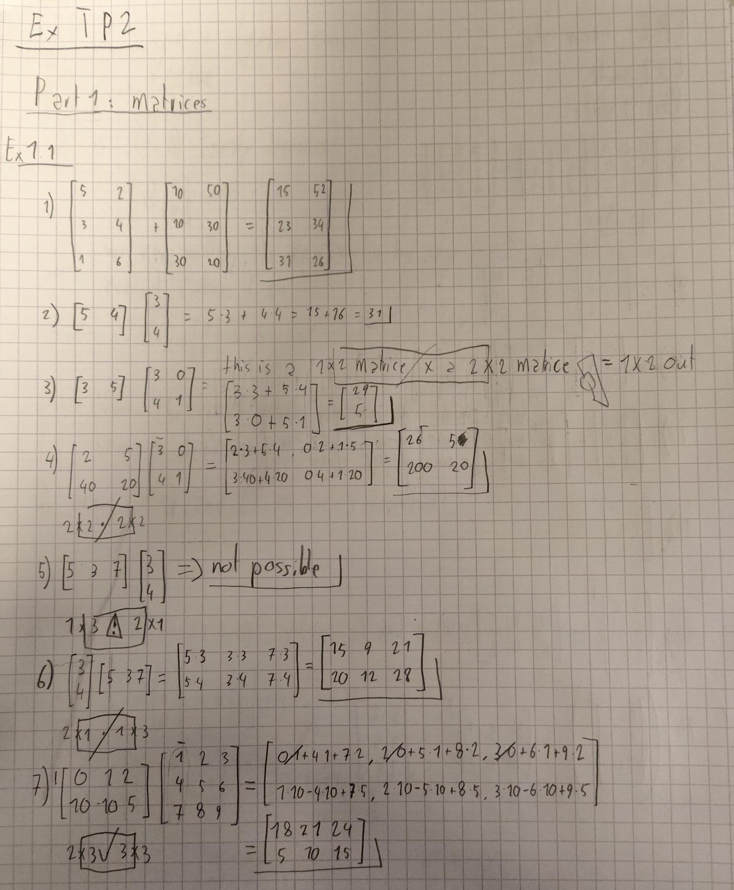

Problem 8 to 14 : 
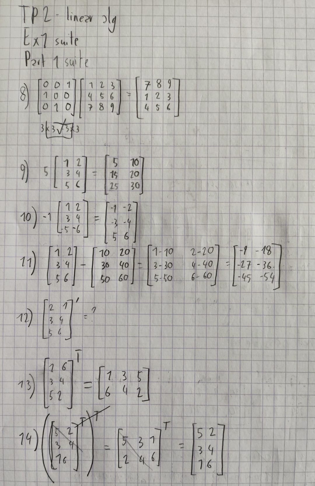

For exercise 12, I left it blank because I wasn't sure what the ' prime symbol meant at the time, since we hadn't seen that notation in our lessons. I know the rest of the groupe generally assumed it was a transpose, and I share this interpretation, so I'll write the transposed matrix just in case : 

$$
\begin{bmatrix}
2 & 1 \\
3 & 4 \\
5 & 6
\end{bmatrix}' = 
\begin{bmatrix}
2 & 1 \\
3 & 4 \\
5 & 6
\end{bmatrix}^T = 
\begin{bmatrix}
2 & 1 & 5\\
1 & 4 & 6 
\end{bmatrix}
$$

### Part 2 : Matrix type
1. Square matrix
   1. A square matrix has the same number of columns as it has of rows. 
2. Column matrix
   1. A column matrix has dimension nx1, so it only has one column. It is vertical => Tall
3. Row matrix
   1. A row matrix has dimension 1xm, so it has many columns but only one row => Wide
4. Identity matrix
   1. The identity matrix has its diagonal element all at 1 (when $n = m$), and the rest of its element at 0 (when $n \neq m$). It is **always** square. 
   2. In a way, it is a sort of permuation matrix. It permuts the vector into itself ? 
   3. If we multiply it with a vector, we get the vector itself. 
   4. The identity matrix is a stricter diagonal matrix. 
5. Diagonal matrix
   1. The diagonal matrix has a similar structure to the identity matrix, in a way : when $n=m$ (its diagonal), the element is any number but 0. When not, the number is 0.
6. symmetric matrix
   1. A symmetric matrix has a symmetry access along its diagonal (when $n=m$). So, the element at $n,m$ is the same than the element at $m,n$ 
7. Permutation matrix
   1. A permuation matrix is a matrix that has only one 1 per row **AND** per column. 
   2. The rest of the elements are 0. 
   3. It is always square
8. Upper triangular matrix
   1. An upper triangular matrix is a matrixe where the element below the diagonal (when $n>m$) are all 0. 
   2. The diagonal itself can be any number.
   3. The above part can be any number as well. 
9.  Lower triangular matrix
    1.  A lower triangular matrix is a matrixe where the element above (when $n<m$) the diagonal are all 0. 
    2.  The elements in the diagonal and below can be any number

### Part 3 : Some matrix Operations

For

1. $\frac{1}{n} \mathbf{1}\mathbf{1}^{\mathrm{T}}$
   
   This result in a matrix with dimension nxn, assuming that the 1-vectors have n instances, where all elements are $\frac{1}{n}$

2. $\frac{1}{n} \mathbf{1}\mathbf{1}^{\mathrm{T}}\mathbf{x}$
   
   Here, we're doing a multiplication between the nxn matrix $\frac{1}{n} \mathbf{1}\mathbf{1}^{\mathrm{T}}$ and one nx1 vector $x$. This result in a nx1 vector where every every element $x_i$ is the mean of $\mathbf{x}$, $\mu_x$. 

3. $\mathbf{x} - \frac{1}{n} \mathbf{1} \mathbf{1}^{\mathrm{T}} \mathbf{x}$
   
   Here, we'll be taking our constant mean of $\mathbf{x}$ vector we computed earlier, and substracting it from the base $\mathbf{x}$. In essence, it means that for each element $\mathbf{x}_i$, we substract $\mu_\mathbf{x}$. This result in a vector nx1 based on $\mathbf{x}$ that has been demeaned, so it has a new mean of 0. 

4. $\left[\mathbf{I} - \frac{1}{n} \mathbf{1} \mathbf{1}^{\mathrm{T}} \right] \mathbf{x}$

   This notation is equivalent to the precendant notation, but arrive to the result in a different, arguably more elegant way. First, $\left[\mathbf{I} - \frac{1}{n} \mathbf{1} \mathbf{1}^{\mathrm{T}} \right]$ is called a centering matrix. It is a nxn matrix where every element on the diagonal is $1-\frac{1}{n}$, and every other element is $\frac{1}{n}$. As its name suggest, it center the vector around its mean. 
   
   We can think of it this way : the identity matrix $\mathbf{I}$ preserve the vector as it it. $\frac{1}{n} \mathbf{1} \mathbf{1}^{\mathrm{T}}$ is a matrix that, when multiplying a vector, turn it into its mean. So, when we distribute the vector $\mathbf{x}$, we arrive to this situation : 

   $$
   \mathbf{Ix} - \frac{1}{n} \mathbf{1} \mathbf{1}^{\mathrm{T}} \mathbf{x}
   $$

   which can be simplified to this since $\mathbf{Ix = x}$.: 

   $$
   \mathbf{x} - \frac{1}{n} \mathbf{1} \mathbf{1}^{\mathrm{T}} \mathbf{x}
   $$

    We've seen that $\frac{1}{n} \mathbf{1} \mathbf{1}^{\mathrm{T}} \mathbf{x}$ is the mean vector, so we can more clearly see what we're substracting. And as vector substraction is done element wise, we're doing this $(x_i - \mu_x)$ to each elements of $\mathbf{x}$.    

5. $\left[\mathbf{I} - \frac{1}{n} \mathbf{1} \mathbf{1}^{\mathrm{T}} \right] \mathbf{1}$
   
   Instead of taking the vector $\mathbf{x}$ here, we use the 1-vector. Because this vector is already constitued by its means (all elements are 1, the mean is 1), the resulting vector $\mathbf{x}'$ is the $\mathbf{0}$-vector. To see more clearly what we're doing : 

   $$
   \left[\mathbf{I} - \frac{1}{n} \mathbf{1} \mathbf{1}^{\mathrm{T}} \right] \mathbf{1} = \mathbf{I1} - \frac{1}{n} \mathbf{1} \mathbf{1}^{\mathrm{T}} \mathbf{1} = \mathbf{1} - \frac{1}{n} \mathbf{1} \mathbf{1}^{\mathrm{T}} \mathbf{1}
   $$

   Since $\frac{1}{n} \mathbf{1} \mathbf{1}^{\mathrm{T}} \mathbf{\color{Red} 1}$ is the operation to obtain the mean of the vector in red, and that the mean of every elements of the $\mathbf{1}$-vector (in red) is 1, we arrive in this position :

   $$
   \frac{1}{n} \mathbf{1} \mathbf{1}^{\mathrm{T}} \mathbf{1} = \mathbf{1}
   $$ 
   Thus leading to have this situation : 

   $$
   \mathbf{1} - \frac{1}{n} \mathbf{1} \mathbf{1}^{\mathrm{T}} \mathbf{1} = \mathbf{1} - \mathbf{1} = \mathbf{0}
   $$

   This is the same thing to what we applied in the 4. exercice, except this time the vector is a constant vector (a constant vector is one where all its elements are the same). Had we used any other constant vector, we would have also got the $\mathbf{0}$-vector. 

6. $\mathbf{M} = \mathbf{I} - \frac{1}{n} \mathbf{1} \mathbf{1}^{\mathrm{T}}$

   Here, the matrix $\mathbf{M}$ is the matrix we used in the above 4 and 5 exercice. It has dimension nxn, and its content is : 
   - On the diagonal, all the element are $1-\frac{1}{n}$
   - All the other elements are $-\frac{1}{n}$
   
   We've seen that one of its usage when multiplying a vector is to center it around its mean while preserving its variance. 

7. $\mathbf{1}^\mathrm{T}\mathbf{x}$
   
   This result in a scalar that is equal to the sum of all the element of $\mathbf{x}$. 1xn and nx1 => scalar. 

8. $\mathbf{1}^\mathrm{T}\mathbf{Mx}$

   This result in 0. We've established earlier that using this $\mathbf{M}$ matrix result in a vector whos mean is centered around 0. When adding all the elements together (which is what we do when we take the dot product $\mathbf{1}^\mathrm{T}\mathbf{Mx}$), we thus get 0. 

   Quick dimension check : $\mathbf{1}^T$ => 1xn. $\mathbf{Mx}$ => nx1. 1xn-nx1=>scalar. $\mathbf{Mx}$ is equal to the question 3 and 4. 

9.  $\mathbf{MM}$
   
      Here, we're doing matrix multiplication of $\mathbf{M}$ with itself. However, one of the property of this matrix is that is is idempotent, meaning once it is applied once, applying it again does nothing. As such, $\mathbf{MM} = \mathbf{M}$. Extrapolating, $\mathbf{MMx} = \mathbf{Mx}$.
   
      To understand this, we can think about how, once a vector is projected onto something by the $\mathbf{M}$ matrix, re-applying the matrix does not do anything : the vector is already where it needs to be, centered around its mean. Re-centering it would do nothing : it's already centered. 

      This idempotency is a property of all projection Matrix, and is proved [here](https://statproofbook.github.io/P/mlr-idem.html)

10. $\mathbf{x}^\mathrm{T}\mathbf{x}$
    
      This is the standard formula for taking the dot product of $\mathbf{x}$ with itself. The result is a scalar equal to the sum of all the element squared of $\mathbf{x}$. This is also equal to the norm squared of $\mathbf{x}$.

11. $(\mathbf{M})^\mathrm{T}(\mathbf{M})$
    
      Here, we're testing exercise 9 again, but this time with a transposed $\mathbf{M}$ matrix. However, $\mathbf{M}$ is symetric : the element above and below the diagonal are all the same, so transposing it does nothing. Functionnaly speaking : $(\mathbf{M})^\mathrm{T} = \mathbf{M}$.

      As such, $(\mathbf{M})^\mathrm{T}(\mathbf{M}) = \mathbf{MM} = \mathbf{M}$ still. 

12. $\mathbf{x}^\mathrm{T}\mathbf{y}$
    
      This is the formula to take the dot product with two vector. Assuming both vector have the same number of element, this result in a scalar that  is the sum of the element-wise product of the two vector. 

13. $(\mathbf{M} \mathbf{x})^\top (\mathbf{M} \mathbf{y})$

      In this equation, we're getting close to calculating the covariance between $\mathbf{x}$ and $\mathbf{y}$. To remember, the equation of the covariance is :

      $$\sigma_{xy} = \frac{1}{n-1} \sum_{i=1}^n (x_i - \mu_x)(y_i - \mu_y)$$

      Here, by taking $\mathbf{Mx}$, we've effectively arrived to $(x_i - \mu_x)$. By then taking the dot product between those two centered vector $\mathbf{x}$ and $\mathbf{y}$, we're effectively computing the sum that the part $\sum_{i=1}^n (x_i - \mu_x)(y_i - \mu_y)$ computes. It is a scalar. 

      We still need $\frac{1}{n-1}$ to compute the covariance however. 

14. $\frac{1}{n-1}(\mathbf{M} \mathbf{x})^\top (\mathbf{M} \mathbf{y})$

      This is the covariance formula for $\mathbf{x}$ and $\mathbf{y}$. We've seen in the 13. exercise that $\mathbf{Mx}^\top\mathbf{My} = \sum_{i=1}^n (x_i - \mu_x)(y_i - \mu_y)$, and that all we needed what the first $\frac{1}{n-1}$ factor at the beginning. 

15. $\mathbf{MX}$

      We've established that $\mathbf{M}$ was a nxn matrix, and we know that $\mathbf{X}$ is a nxk matrix. As such, the result of $\mathbf{MX}$ will be a nxk matrix. 

      Given that applying $\mathbf{Mx}$ transform $\mathbf{x}$ into its demeaned version, it is nice to know that $\mathbf{MX}$ is pretty straightforward : it demean every columns of $\mathbf{X}$ by its mean, effectively demeaning the entire matrix. 

      We can think of it like that. 
      $$\mathbf{X} = \set{\mathbf{x_1, x_2,..., x_k}}\$$
      where every $\mathbf{x_i}$ is a column/feature vector. Here, $\mathbf{MX} = \set{\mathbf{Mx_1, Mx_2,..., Mx_k}}$. And we know that $\mathbf{Mx_i}$ is simply $\mathbf{x_i}$ demeaned.  

16. $\left( \mathbf{MX} \right)^\top \left( \mathbf{MX} \right)$

      Here, we'll be multiplying the demeaned matrix by itself. We've seen that $\mathbf{MX}$ produces a nxk matrix with each column demneaed matrix. Transposing the first part of the formula mean making a kxn ° nxk matrice multiplication, resulting in a final kxk matrice. 

      This is close to resulting in the covariance matrix, but it's once again missing that final $\frac{1}{1-n}$ factor to get there that would normalize it. What we have here is a square matrix where each element is the sum of the deviation between each pair of $i,j$ features, where $i,j = 1 ... k$. 

      - The diagonal entries (when $i=j$) represent the sum of squared deviations from the mean for each column $i,j$.
      - The off-diagonal entries (when $i \neq j$) represent the sum of the product of deviations from the mean between each pair of columns $i,j$.
      
      If we wanted to get the covariance matrix, we'd need to factor the result by $\frac{1}{n-1}$ : $\frac{1}{n-1}\left( MX \right)^\top \left( MX \right)$. This would result in a symetrical, square, kxk matrix where the diagonal are 1 (since the pair $i,j$ of row,column are actually the same thing originaly before the transpose, and thus have a perfect covariance.), while the other elements would be the covariance between each pair of $i,j$ features. 

Add-on : This serie of exercice doesn't directly give us the variance as per the equation that was mentioned at the start of the exercice. If we wanted to compute the variance of $\mathbf{x}$ like in the formula given, but with vector, we could do this : 

$$
\sigma_x^2 = \frac{1}{n-1}\|\mathbf{Mx}\|^2
$$

## Ex-2
### Part 1 : Definition of linear dependance
The definition of linear dependence for a set of vectors can be written as : 
$$\beta_1 \alpha_1 + \cdots + \beta_k \alpha_k = 0$$
where the set of vectors $\alpha$ is linearly dependant if there are solutions for the notation to be corret other than by setting all $\beta_i=0$. 

---
Is $\{0, 0\}$ linearly dependent ? 

We can multiply the $\{0, 0\}$ vector by any $\beta \in \mathbb{R}$ and still get a correct value. Example : 

$$\beta \cdot \begin{bmatrix} 0 \\ 0 \end{bmatrix} = \vec{0}$$
Correct values include : 
$$1 \cdot \begin{bmatrix} 0 \\ 0 \end{bmatrix} = \vec{0}, \quad 2 \cdot \begin{bmatrix} 0 \\ 0 \end{bmatrix} = \vec{0}, \quad -1 \cdot \begin{bmatrix} 0 \\ 0 \end{bmatrix} = \vec{0}.$$

Since the set of possible answers $\beta$ is more than just 0, it is linearly dependent.

---

Are $\{1, 0\}$ and $\{2, 10\}$ linearly dependent ?

Since $\{2, 10\} = 2 \{1, 5\}$, they are linearly dependent. 

---
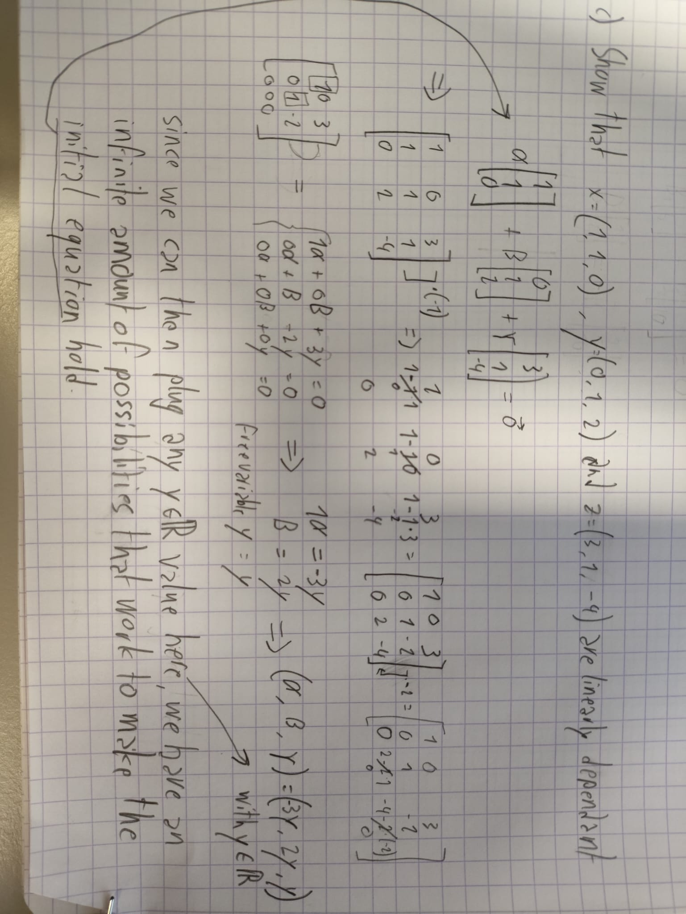
Note : When checking for linear (in)dependence, we do not need to write the $\vec{0}$ target vector inside of the matrice, because it would always remain 0 no matter what. So, we do not need to build an augmented matrice. The process remain the exact same nonetheless. 

---
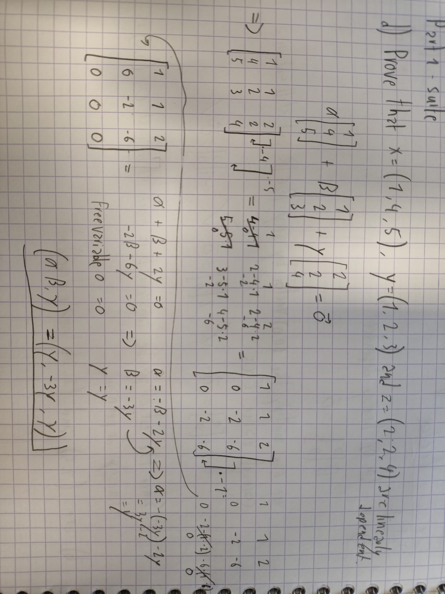

---

### Part 2 : Définition of linear independence

A set of vector $\alpha$ are linearly independent if the only way to make this equation hold is by setting all $\beta_i$ to 0 : 

$$\beta_1 \alpha_1 + \cdots + \beta_k \alpha_k = 0$$

If at least one $\beta_i$ is not 0, and the equation still hold, then the set is linearly dependent. 

---
Ex a) Show that the vectors (1,2) and (3,4) are linearly independent.

For small quantities of small vectors, one easy test is to see if we can obtain one vector by multiplying a set of the others : 

$$
\beta_1 \begin{bmatrix}
1 \\
2
\end{bmatrix} = 
-\begin{bmatrix}
3 \\4
\end{bmatrix}
$$

(Note : this above notation is just the first equation re-written)

Here, it's obvious that there are no $\beta$ value that make this equation true. So, the set of vector is linearly independent. This becomes much harder to do with more, bigger vectors. I'll do the exercice b) with a standard method. 

---
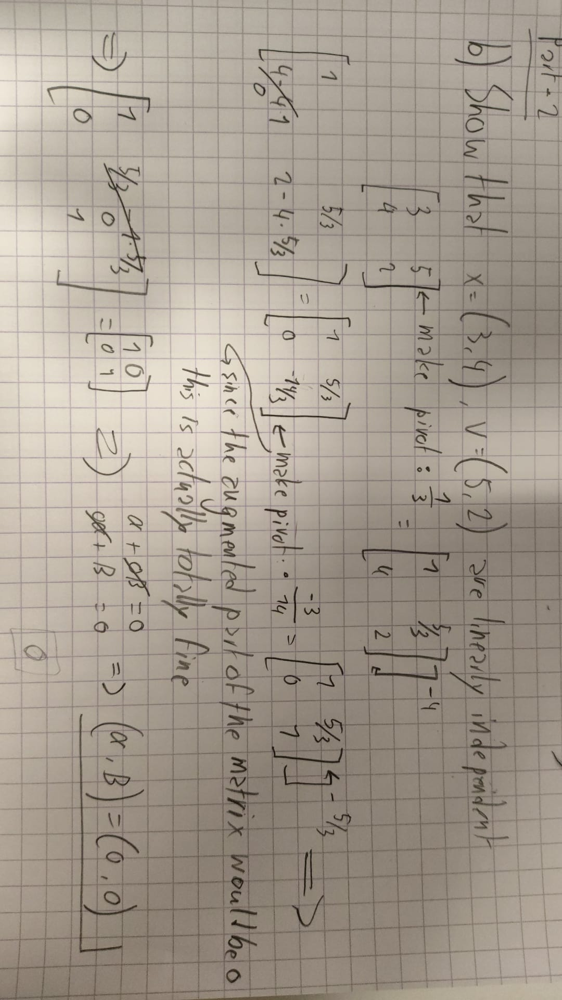

---

### Part 3

 Let w =(1,1,0,0),x = (1,0,1,0),y = (0,0,1,1), and z = (0,1,0,1).

Part a : 
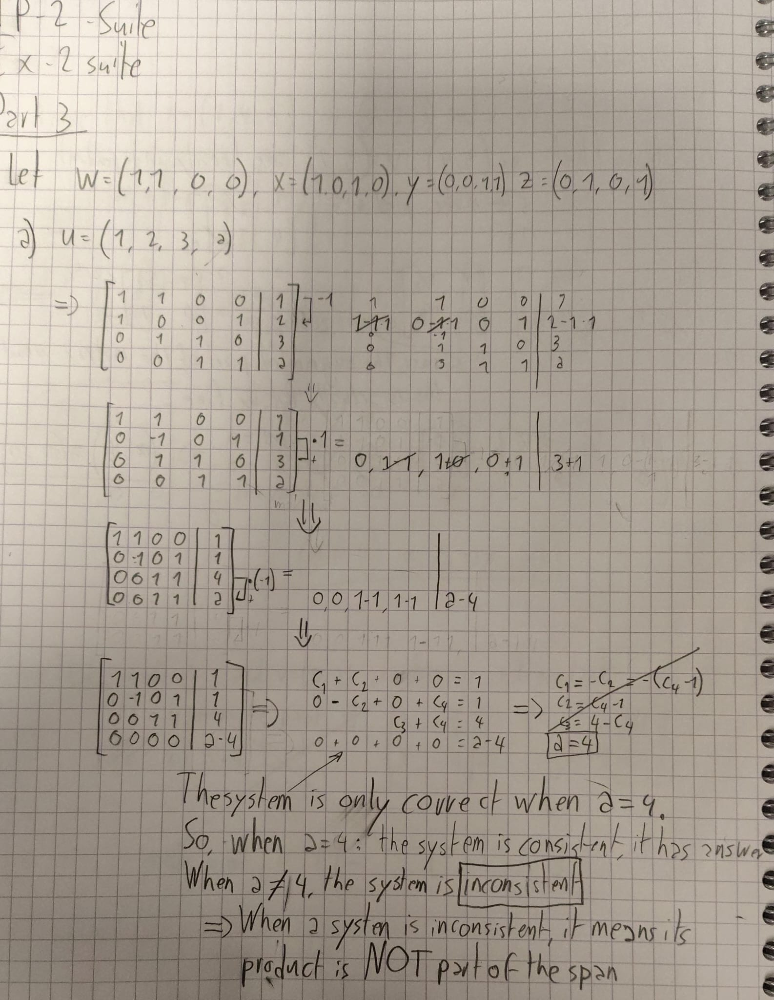

So : 

$$\mathbf{u} \in \text{span}\{\mathbf{w}, \mathbf{x}, \mathbf{y}, \mathbf{z}\} \iff a = 4$$
$$\mathbf{u} \notin \text{span}\{\mathbf{w}, \mathbf{x}, \mathbf{y}, \mathbf{z}\} \iff a \neq 4$$

---
Part b
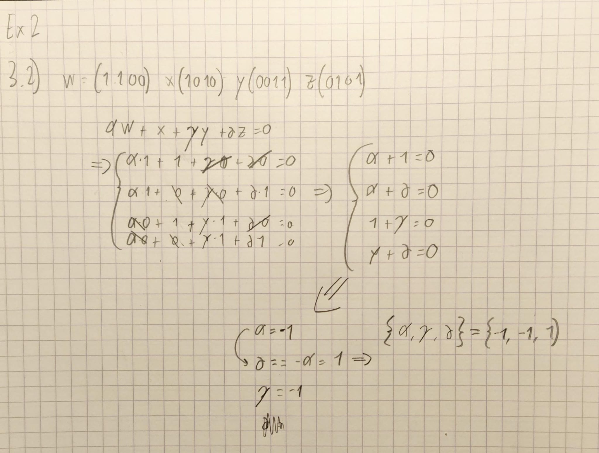

So : 
$$
\{\alpha, \gamma, \delta\} = \{-1, -1, 1\}
$$
---

Part c : 
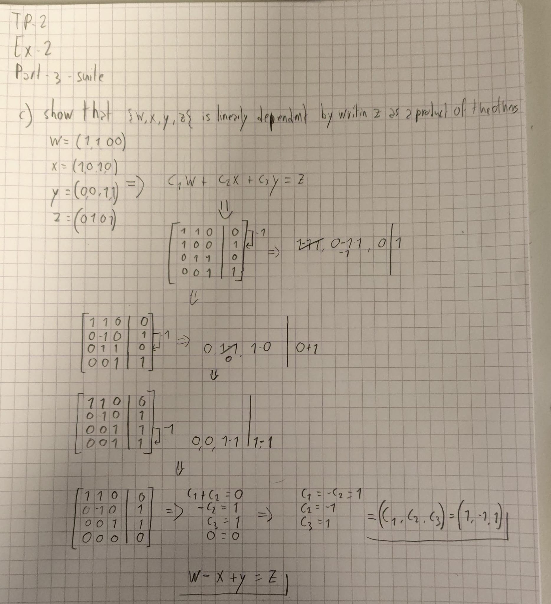

$$\mathbb{c}_1\mathbb{w} + \mathbb{c}_2\mathbb{x} + \mathbb{c}_3\mathbb{y} = \mathbb{z} \iff \mathbb{c}_1 = 1, \mathbb{c}_2 = -1, \mathbb{c}_3 = 1$$

Since there exist an answer other than having all $\mathbb{c}$ to 0, the set $\set{w,x,y,z}$ is linearly dependent.

---

### Part 4

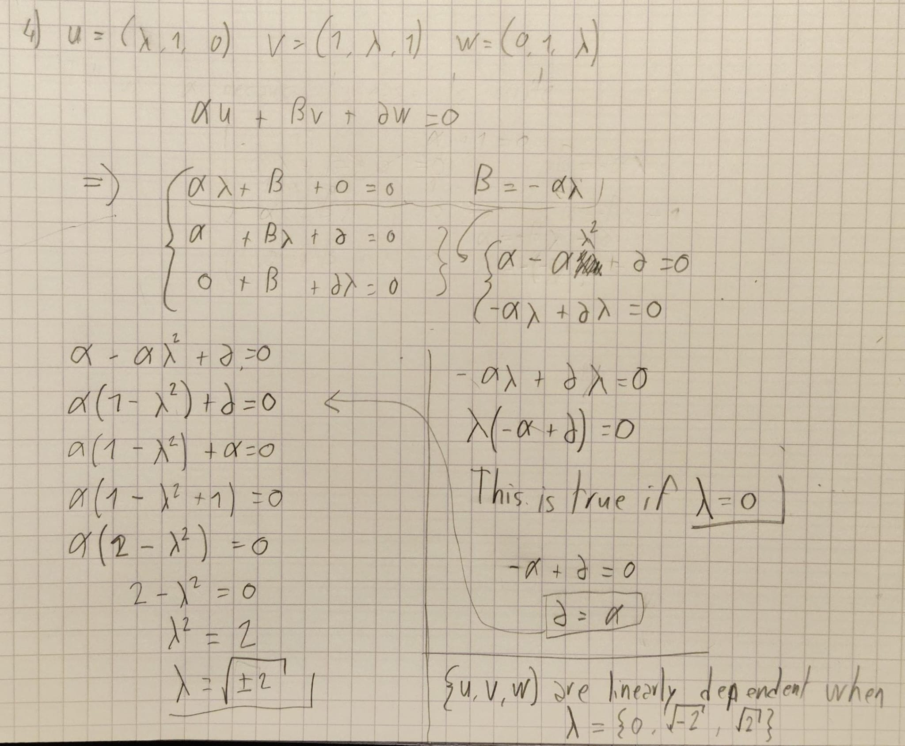

$\{ \mathbf{u}, \mathbf{v}, \mathbf{w} \}$ are linearly dependent when $\lambda = \{ 0, -\sqrt{2}, \sqrt{2} \}.$

### Part 5

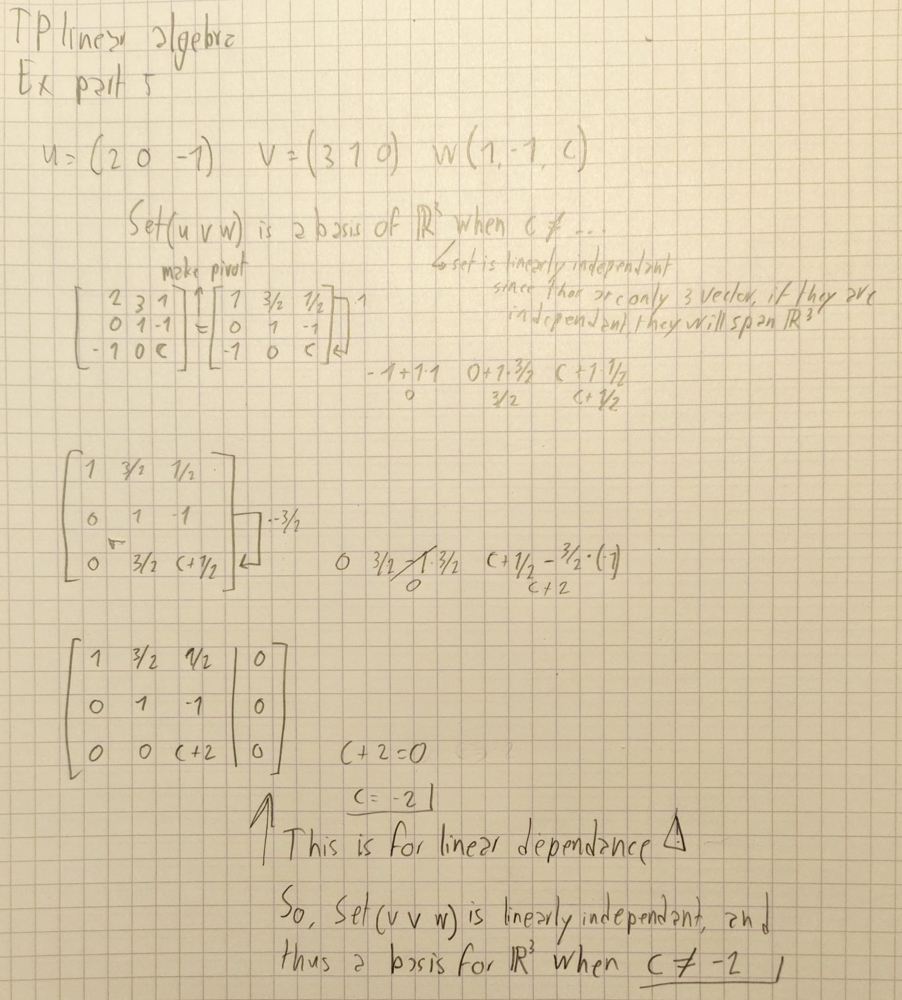

Set $\{\mathbf{u}, \mathbf{v}, \mathbf{w}\}$ is a basis for $\mathbb{R^3}$ when $\mathbb{c}\neq -2$

### Part 6

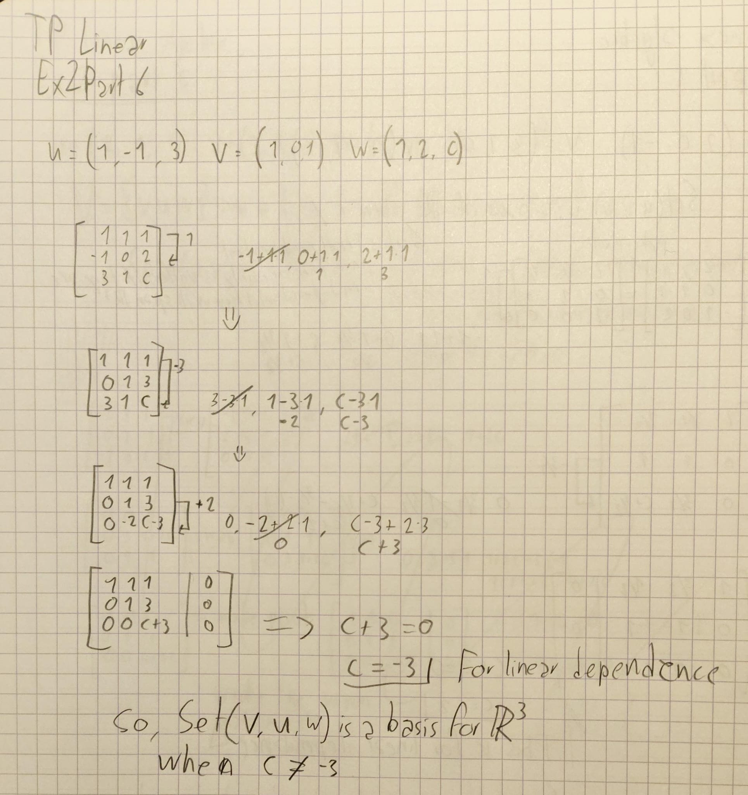

Set $\{\mathbf{u}, \mathbf{v}, \mathbf{w}\}$ is a basis for $\mathbb{R^3}$ when $\mathbb{c}\neq -3$

### Part 7

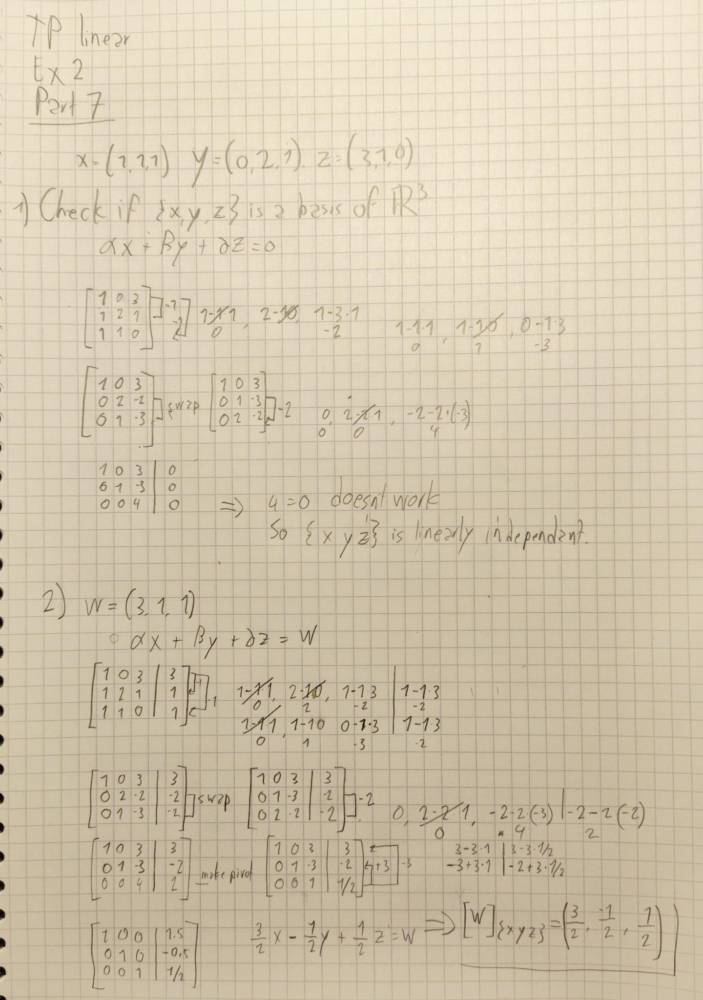

In the basis of $\set{x,y,z}$, $\mathbb{w}$ can be exprimed as $\left( \frac{3}{2}, -\frac{1}{2}, \frac{1}{2} \right)$

### Part 8
First part, converting to orthonormal basis : 
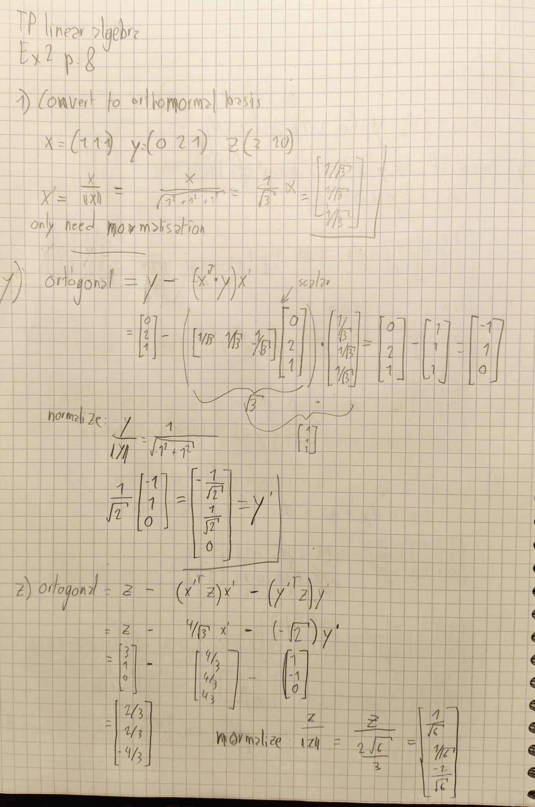

So : 

$$
\mathbf{x}' = \begin{bmatrix}
\frac{1}{\sqrt{3}} \\
\frac{1}{\sqrt{3}} \\
\frac{1}{\sqrt{3}}
\end{bmatrix}, \quad
\mathbf{y}' = \begin{bmatrix}
\frac{-1}{\sqrt{2}} \\
\frac{1}{\sqrt{2}} \\
0
\end{bmatrix}, \quad
\mathbf{z}' = \begin{bmatrix}
\frac{1}{\sqrt{6}} \\
\frac{1}{\sqrt{6}} \\
-\frac{2}{\sqrt{6}}
\end{bmatrix}.
$$

Second part : find w using the orthonormal basis. 
Since we computed the ortonormal basis, we can find the coef to $\mathbb{w}$ by simply taking the dot product between $\mathbb{w}$ and $\mathbb{x'}$, and do so for the rest for the vectors as well. The product is the coef for $\mathbb{x'}$ to multiply it to obtain $\mathbb{w}$.

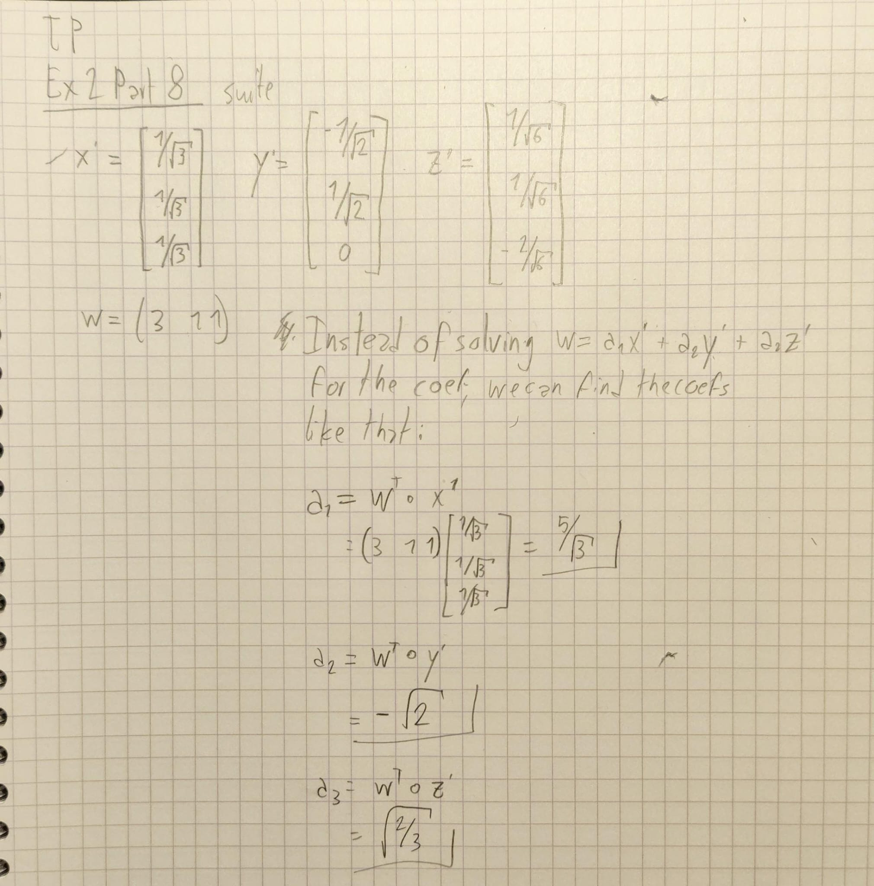

So : 
$$
\mathbf{w} = a'_1 \mathbf{x}' + a'_2 \mathbf{y}' + a'_3 \mathbf{z}' \iff \set{a'_1,a'_2,a'_3} = \set{\frac{5}{\sqrt{3}}, -\sqrt{2}, \sqrt{\frac{2}{3}}}
$$

## 3 : Convolution

(Note for future me : If you forgot what a convolution is, just check [this](https://www.youtube.com/watch?v=KuXjwB4LzSA), it's veryyyyyyy good)

### Part 1 : 1D signal

1. The function conv1d, takes several arguments: x, kernel, padding, stride, please define each of this terms and how they are used in the convolution.
   1. x is the signal itself, a timeserie of some sort where every element after the first has some ties to its precedent element, be it simply because it is the one of the day/hour/etc... after, or because the value is based on some operation done on the precedent value. In essence, it's a 1-d vector with n instance. 
   2. The kernel can be thought of as some sort of function. It takes a vector in input (all the values of the time serie that can fit given the current position of the cursor i and the current center of the kernel) and produce a scalar in output, which, in this case, is the sum of all the element in input divided by 5. 
   3. The padding is something that can be used to add some element to the base timeserie to avoid the problem that arise when the entire kernel can not be fitted in the timeserie yet. This happen at the start and at the end of the unpadded timeserie, when the elements that would be the window, given the current position of i, are less than kernel_len. Without padding, this may cause trouble with out of bound error, incorrect values, or may cause the output to be smaller than the base signal. It happens in my base conv1d method, where the signal is 1000 elements long and the output result is 996 elements long.  
   4. The stride is by how much we move the cursor i every time. It has a few effects : first, it changes the size of the result like this : len(result) = len(signal)/stride. As the stride augment, the effect that the kernel applies is made more apparent. If too big, it may output a completely unpredictable, useless result, especially if stride > kernel_len
2. What can you say about the kernel we choose to apply to the time series? If the time series is the evolution of a stock price, then what is the convolution doing?
   1. We applied a kernel like this : $[1/5, 1/5, 1/5, 1/5, 1/5]$, which will take an input of its same size (5) and take the dot product to produce a scalar. Here, with this kernel, it means that the input values are summed and then divided by 5. In other word, the new, convoluted value is an average of those 5 inputs. 
   2. If this was the evolution of the stock price, it would mean that the value at the current position of i would be smoothed out based on the values of the 2 next and past days, taking the average values of those 4 days as well as the day at i to produce the new, convoluted value. In more economic terms, this become the moving average of the days around it. 
3. Look at the time series before and after the convolution, are the curves the same? If they aren't, explain the effect of the convolution.
   1. The curves are not the same, but they are still similar. What has been done to them is that they have been smoothed out, they aren't as jagged as before. This is because the kernel we designed takes the values of the elements around a given point and averages them out, meaning that, after convolution, the values are all a little bit closer to each other, which is what causes this smoothing effect. 

### Part 2 : 2D convolution. 

In 2D convolution, the easiest way to think about it is with an image, as an image is, after all, just a 2D matrix of pixel (as long as it's in grayscale). Then, our kernel is also a matrix, but its function is still the same. For a given point $i,j$, the kernel capture all the points around it that fit the kernel (once again, think of the kernel as being centered around the point, and checking which values fits in it), multiplie the values of those points by the value of their element wise pair in the kernel, sum all of this up, and that sum is the value of the new, convoluted $i,j$ value. 

#### First kernel : Edge detection

The first kernel : 
$$
\begin{bmatrix}
-1 & -1 & -1 \\
-1 & 8 & -1 \\
-1 & -1 & -1
\end{bmatrix}
$$

is an edge detection kernel. It is designed to emphasize areas in an image where there are rapid changes in intensity, which often correspond to edges.

This kernel works by giving a strong, positive weight to the center pixel (8) and subtracting the values of its surrounding neighbors with weights of -1. The result of this operation reflects the difference between the center pixel's grayscale value (intensity) and the average values of its neighboring pixels. When the kernel is applied to an area with little to no change in grayscale values (for example, a flat surface or uniform color), the contributions of the neighbors (nearly) cancel out the strong central value, leading to a value close to 0, which is black-ish in a greyscale image. When the kernel is applied to an area with a sharp change in grayscale values (for example, a boundary between a dark and a light region), the center pixel’s value will differ significantly from its neighbors. This difference produces a large positive value, which is more white. 

#### Second kernel : Sharpening 

The second kernel : 

$$
\begin{bmatrix}
0 & 0 & 0 & 0 & 0 \\
0 & 0 & -1 & 0 & 0 \\
0 & -1 & 5 & -1 & 0 \\
0 & 0 & -1 & 0 & 0 \\
0 & 0 & 0 & 0 & 0 \\
\end{bmatrix}
$$

is a sharpening kernel. It starts off simialr to an edge detection kernel, with a big positive center value surrounded by low negative value. However, the key difference is in the sum of the kernel : if sum = 0, then the kernel is an edge detection kernel. If sum > 0, it's a sharpening kernel. 

In effect, this kernel works the same way as an edge detection kernel. When in a smooth, uniform region, the value of the center pixel gets negated by its neighboors, but because the center is always valued a little bit more than the sum of the neighboors (since the sum > 0), the final value end up staying close to the original value, which preserve the value mostly close to the original value. 

When covering an area with a change in values like an edge, the kernel works the exact same way as an edge detection kernel. 

#### Third Kernel : Gaussian blur

The kernel

$$
\frac{1}{256} \cdot
\begin{bmatrix}
1 & 4 & 6 & 4 & 1 \\
4 & 16 & 24 & 16 & 4 \\
6 & 24 & 36 & 24 & 6 \\
4 & 16 & 24 & 16 & 4 \\
1 & 4 & 6 & 4 & 1 \\
\end{bmatrix}
$$

is a blurring kernel, more specifically Gaussian blur. All blurring kernel follow the same overall logic : the value of the center pixel become an average of all the pixels surrounding it. At its most basic, all pixel are valued equal with a kernel that looks like this : 

$$
\frac{1}{9}
\begin{bmatrix}
1 & 1 & 1 \\
1 & 1 & 1 \\
1 & 1 & 1
\end{bmatrix}
$$

A gaussian blur kernel is a variant of this that gives more importance to the pixels closer to the center and slowly lower the importance for the pixels that are further away, following a Gaussian curve. This is done symetrically. The result on the image is a more natural feeling of blur. 

The normalization factor ($\frac{1}{256}$) is there to assure that the overall sum of the kernel is 1. This help in making sure than any result from the blurring effect keeps the same general tone, and doesn't suddenly become a lot brighter or darker. 

## 4 : Rotation of a 2D dataset. 

The matrix is sourced from [here](https://en.wikipedia.org/wiki/Rotation_matrix#In_two_dimensions).

The intuition to better understand is a video [here](https://www.youtube.com/watch?v=Ta8cKqltPfU)

Explain what you see in the above figure, what does the rotation matrix do to the dataset? Does the distance change between the points in the dataset after a rotation ? If the distance between the points changes, give the formula to compute the new distance.

### What does the matrix do to the dataset ? 

Unsurprisingly, what a rotation matrix do to a dataset is pretty self-explanatory : it rotates it by a defined degree (WOAW). 

To understand how it works, let's start with only a single (unit) vector $[1,0]$, on the unit circle. We can imagine rotating it $\theta$ degree counterclockwise, keeping its tail on the origine while its head move $\theta$ along the unit circle. Because its length (or hypothenuse) stay the same (1), we can still compute its coordinates using trigonometry : 

(Note to futur me : if this isn't clear, check the vid, it's way more visual, I can't do (good) pictures here.)

$$\cos{\theta} = \frac{x}{hypothenuse} 
\to \cos{\theta} = x
$$
similarly, for the $y$ value of this vector : 
$$
\sin{\theta} = \frac{y}{hypothenuse} 
\to \sin{\theta} = y
$$
So 
$$
rotated [1,0] = [cos {\theta}, sin{\theta}]
$$

If we now take a second vector on the unit vector, this time $[0,1]$, and rotate it in the same direction by $\theta$ as well, it's coordinate can once again be obtained via trigonometry : 

$$
\sin\theta = \frac{x}{hypothenuse} 
\iff sin\theta = x
$$
Though, here, in this case, the value of x is negative. So, it's actually $-sin$

Still, we also have :
$$
\cos{\theta} = \frac{y}{hypothenuse} 
\to \cos{\theta} = y
$$

So : 
$$
rotated[0,1] = [-sin\theta, cos\theta]
$$

With this setup, we have the rotation function for the two unit vector of a 2D matrix : 

$$
\begin{bmatrix}
\cos\theta & -\sin\theta \\
\sin\theta & \cos\theta
\end{bmatrix}
$$
which is simply the two vector we found earlier, put vertically. And since any vector $[x,y]$ can be thought of as a scaling of the two unit vector, this formula applies to any 2D vector. 

From there, we can apply this to a dataset, thinking of each instance $n$ as its own vector $[x,y]$ to apply the transformation to : 

$$
\begin{bmatrix}
\cos\theta & -\sin\theta \\
\sin\theta & \cos\theta
\end{bmatrix}
\begin{bmatrix}
x \\
y
\end{bmatrix}
$$

### Does the transformation conserve the distance between points ?

As we've seen in our example, the length (or norm) of a rotated vector was kept through the transformation. Because we apply the tranformation to every $n$ instance through the dataset uniformarly, all their own length stay the same, and they keep pointing in the same, rotated direction so, the overall position of each points compared to each other stay the same.

In the notebook, the cell before the last one shows how this intuition is true. 

